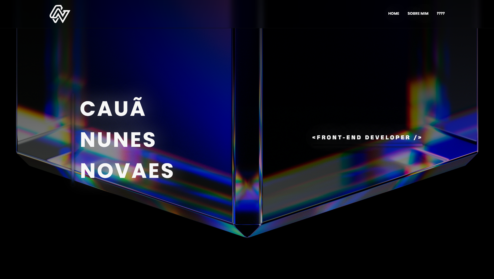

# PORTFOLIO | CAUÃ NUNES NOVAES

Hello! How are you?</br>
This is a portfolio and resume project, developed using Astro Build by Cauã Nunes Novaes.</br>
The goal is to communicate professional skills, projects, and expertise to the reader.



## 🚀 Project Structure

Inside of project, you'll see the following folders and files:

```
/
├── .github
│   ├── assets
│   │   └── portfolio-hero.png
│   └── workflows
│       └── deploy.yml
├── public
│   ├── fonts
│   │   ├── AnekDevanagari
│   │   │   ├── Anek-Devanagari.ttf
│   │   │   └── OFL.txt
│   │   ├── Poppins
│   │   │   ├── OFL.txt
│   │   │   ├── Poppins-Black.ttf
│   │   │   ├── Poppins-BlackItalic.ttf
│   │   │   ├── Poppins-BoldItalic.ttf
│   │   │   ├── Poppins-ExtraBold.ttf
│   │   │   ├── Poppins-ExtraBoldItalic.ttf
│   │   │   ├── Poppins-ExtraLight.ttf
│   │   │   ├── Poppins-ExtraLightItalic.ttf
│   │   │   ├── Poppins-Italic.ttf
│   │   │   ├── Poppins-Light.ttf
│   │   │   ├── Poppins-LightItalic.ttf
│   │   │   ├── Poppins-Medium.ttf
│   │   │   ├── Poppins-MediumItalic.ttf
│   │   │   ├── Poppins-SemiBold.ttf
│   │   │   ├── Poppins-SemiBoldItalic.ttf
│   │   │   ├── Poppins-Thin.ttf
│   │   │   ├── Poppins-ThinItalic.ttf
│   │   │   ├── Poppins_Bold.ttf
│   │   │   └── Poppins_Regular.ttf
│   │   └── RethinkSans
│   │       ├── OFL.txt
│   │       ├── Rethink-Sans.ttf
│   │       └── Rethink-Sans_Italic.ttf
│   ├── logotipoCNN.ico
│   └── logotipoCNN.svg
├── src
│   ├── assets
│   │   └── img
│   │       ├── github.svg
│   │       ├── hero_background.jpg
│   │       ├── instagram.svg
│   │       └── linkedin.svg
│   ├── components
│   │   ├── Footer.astro
│   │   ├── LoaderPage.astro
│   │   ├── LogotipoCNN.astro
│   │   └── Navbar.astro
│   ├── layouts
│   │   └── Layout.astro
│   └── pages
│       ├── aboutme.astro
│       └── index.astro
├── .gitignore
├── README.md
├── astro.config.mjs
├── package-lock.json
├── package.json
└── tsconfig.json
```

## 🧞 Commands

All commands are run from the root of the project, from a terminal:

| Command                   | Action                                           |
| :------------------------ | :----------------------------------------------- |
| `npm install`             | Installs dependencies                            |
| `npm run dev`             | Starts local dev server at `localhost:4321`      |
| `npm run build`           | Build your production site to `./dist/`          |
| `npm run preview`         | Preview your build locally, before deploying     |
| `npm run astro ...`       | Run CLI commands like `astro add`, `astro check` |
| `npm run astro -- --help` | Get help using the Astro CLI                     |

---

_Last update in 28/08/2026_